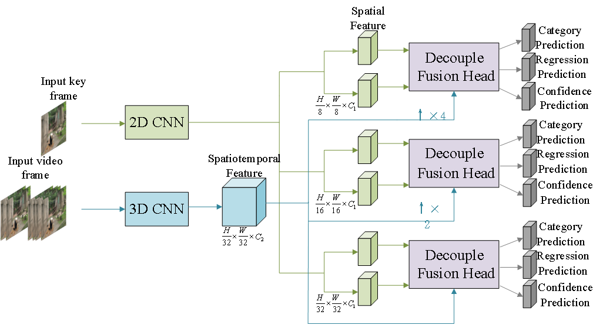
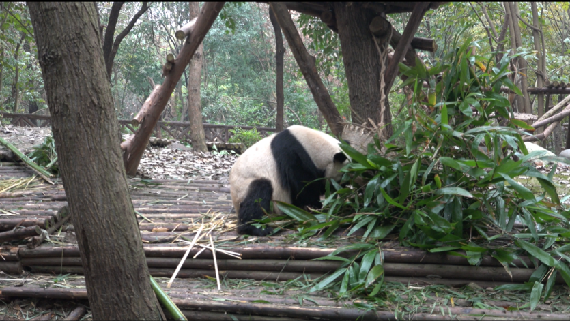
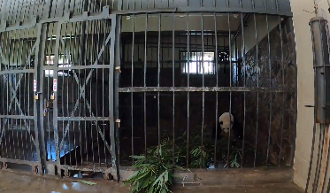
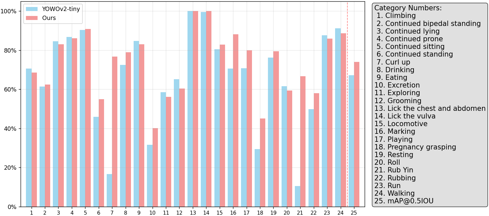
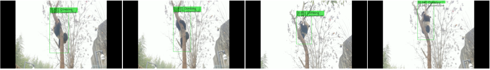

# Giant Panda Behavior Recognition in Captivity Based on YOWOv2-Tiny

English

## Overview of Giant Panda Behavior Recognition


## Abstract
The behavior of captive giant pandas is a crucial indicator of their physical and mental health. Understanding their behavior helps improve animal welfare and refine management practices. This paper categorizes giant panda behaviors into three main types: actions, activities, and pregnancy-related behaviors. We created the Panda Behavior Analysis (PBA) dataset by clipping surveillance videos. We optimized the YOWOv2-Tiny model for panda behavior characteristics and designed a frequency domain attention module called MLSA (Multi-Head Local Spectrum Attention), enabling the model to capture information from temporal, spatial, and frequency domains. Experimental results show that the proposed method achieves a mean Average Precision (mAP) of 73.94% on the PBA dataset, outperforming various baseline methods.

## Requirements
- We recommend you to use Anaconda to create a conda environment:
```Shell
conda create -n panda_behavior python=3.8
```

- Then, activate the environment:
```Shell
conda activate panda_behavior
```

- Requirements:
```Shell
pip install -r requirements.txt
```

## Visualization




# Dataset

## Panda Behavior Analysis (PBA) Dataset:
The PBA dataset contains 2369 video clips of 30 seconds each, covering 24 behavior categories across three main types:

### Actions (10 categories):
- Continued Lying, Continued Standing, Continued Sitting, Continued Prone
- Continued bipedal standing, Running, Walking, Climbing, Rubbing, Rolling

### Activities (9 categories):
- Drinking, Eating, Locomotion, Resting, Exploring
- Playing, Marking, Excretion, Grooming

### Pregnancy-related behaviors (5 categories):
- Pregnancy Grasping, Lick the chest and abdomen, Lick the vulva, Curl Up, Rub Yin

# Experiment

## PBA Dataset Performance

| Model | FLOPs | Params | PBA F-mAP | Improvement |
|-------|-------|---------|-----------|-------------|
| YOWOv2-Tiny (Baseline) | 2.9G | 10.9M | 67.13% | - |
| YOWOv2-Medium | 12.0G | 52.0M | 69.95% | +2.82% |
| YOWOv2-Large | 53.6G | 109.7M | 72.68% | +5.55% |
| **Our Improved YOWOv2-Tiny** | **3.35G** | **14.9M** | **73.94%** | **+6.81%** |

## Public Datasets Performance

| Model | UCF101-24 F-mAP | UCF101-24 V-mAP | JHMDB21 F-mAP | JHMDB21 V-mAP |
|-------|-----------------|-----------------|---------------|---------------|
| YOWOv2-Tiny | 80.5% | 49.91% | 60.12% | 69.22% |
| **Our Method** | **81.74%** | **50.70%** | **60.98%** | **69.81%** |

**category results on PBA dataset**


## Method Improvements

### 1. Enhanced 2D CNN Architecture
- Introduced C3k2 structure with parameter-adaptive characteristics
- Integrated C2PSA module combining multi-head attention and feed-forward network
- Added SPPF multi-scale feature processing module
- Embedded DCAFE attention mechanism for better spatial relationship modeling

### 2. Improved 3D CNN with MLSA Attention
- Combined ShuffleNetV2 with MLSA (Multi-Head Local Spectrum Attention) module
- Enables capture of temporal, spatial, and frequency domain information
- Dynamically learns weight distribution of different frequency components
- Suppresses high-frequency noise while highlighting behavior-related frequency bands

### 3. Enhanced Decoupled Fusion Head
- Replaced original attention mechanism with SCSA (Spatial-Channel Synergistic Attention)
- Strengthens spatial-channel feature interaction capability
- Improves utilization of extracted feature information

## Train Panda Behavior Recognition Model

```Shell
python train.py --cuda -d pba --root path/to/pba_dataset -v yowo_v2_tiny_improved --num_workers 4 --eval_epoch 1 --max_epoch 30 --lr_epoch 3 4 5 6 -lr 0.0001 -ldr 0.5 -bs 8 -accu 16 -K 16
```

or you can use the provided script:

```Shell
sh train_pba.sh
```

For distributed training with multiple GPUs:

```Shell
python train.py --cuda -dist -d pba --root path/to/pba_dataset -v yowo_v2_tiny_improved --num_workers 4 --eval_epoch 1 --max_epoch 30 --lr_epoch 3 4 5 6 -lr 0.0001 -ldr 0.5 -bs 8 -accu 16 -K 16
```

## Test Panda Behavior Recognition

```Shell
python test.py --cuda -d pba -v yowo_v2_tiny_improved --weight path/to/weight -size 224 --show
```

## Evaluate on PBA Dataset

```Shell
# Frame mAP evaluation
python eval.py \
        --cuda \
        -d pba \
        -v yowo_v2_tiny_improved \
        -bs 16 \
        -size 224 \
        --weight path/to/weight \
        --cal_frame_mAP
```

## Demo with Panda Videos

```Shell
# run demo on panda videos
python demo.py --cuda -d pba -v yowo_v2_tiny_improved -size 224 --weight path/to/weight --video path/to/panda_video --show
```

**Qualitative results in real panda monitoring scenarios**


## Ablation Study Results

| Components | PBA F-mAP | FLOPs | Params |
|------------|-----------|-------|---------|
| Baseline (YOWOv2-Tiny) | 67.13% | 2.90G | 10.88M |
| + C3k2 | 68.19% | 3.35G | 13.84M |
| + MLSA | 69.15% | 2.91G | 11.93M |
| + SCSA | 69.38% | 2.90G | 10.88M |
| + All improvements | **73.94%** | **3.35G** | **14.90M** |

## Attention Mechanism Comparison

| Attention Method | PBA F-mAP |
|------------------|-----------|
| SE | 68.37% |
| ECA | 67.60% |
| SA | 66.58% |
| CA | 68.29% |
| CBAM | 70.84% |
| **MLSA (Ours)** | **73.94%** |

## References
If you are using our code or the PBA dataset, please consider citing our paper.

```
@article{jiang2025panda,
  title={Giant Panda Behavior Recognition in Captivity Based on YOWOv2-Tiny},
  author={Jiang, Zhengjin},
  journal={Journal Title},
  volume={XX},
  number={A},
  pages={1--15},
  year={2025},
  publisher={SAGE Publications}
}
```

## Acknowledgments
We thank the Chengdu Research Base of Giant Panda Breeding for providing the surveillance video data used in this research.